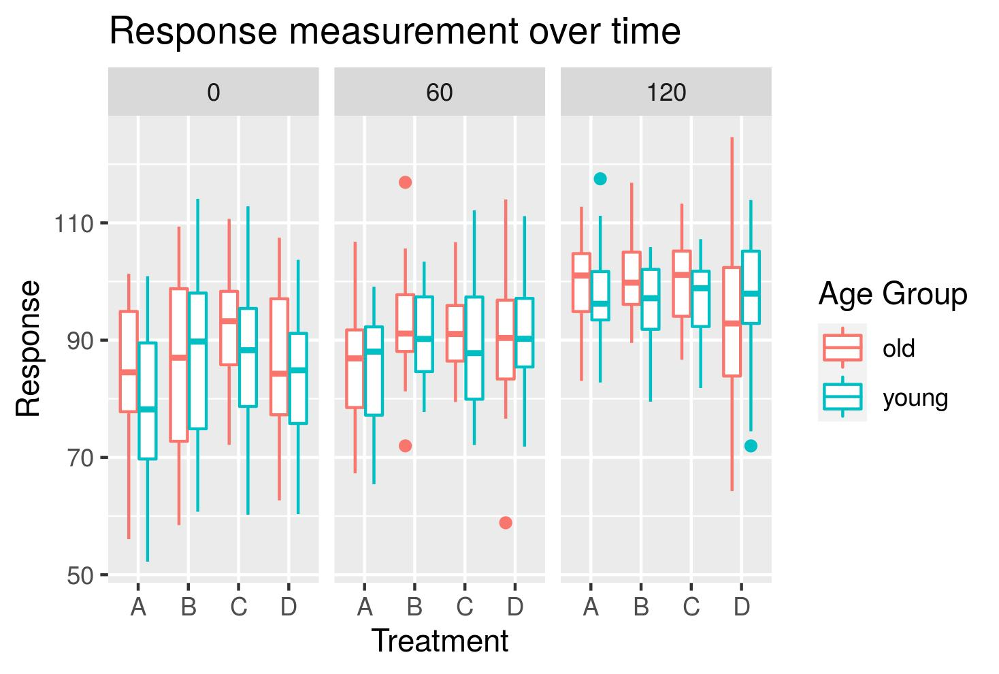

## First ggplot example

Add a setup chunk that loads the tidyverse packages.
```{r}
library(tidyverse)
```


The example dataset
```{r}
ToothGrowth
```


Our first ggplot example

```{r}
ggplot(data=ToothGrowth)+
  geom_point(mapping = aes(x=dose, y=len))
```


Add `color`, `size`, and `shape` aesthetics to the graph for the different supplements

```{r}
ggplot(data = ToothGrowth) +
  geom_point(mapping = aes(x = dose, y = len, col = supp, shape=supp, size=supp))
```
## ggplot Your Turn 
The code chunk below will read in and print your dataset.
```{r}
data <- read_csv('simulated_data.csv')
data
```
In the code chunk below use the `data` to build a point plot where the x axis is `Time` and the y axis is `Response`

```{r}
ggplot(data=data)+
  geom_point(mapping=aes(x=Time, y=Response))
```

Below build the graph again this time adding an aesthetic for `Treatment` and/or `Age_Category`. Experiment with the different aesthetics (Hint: for geom_point the aesthetics are x, y, alpha, color, fill, group, shape, size, and stroke, you can find this out by typing `?geom_point into the console and reading the documentation that comes up in the help box at the bottom right of the IDE)
```{r}
ggplot(data=data)+
  geom_point(mapping=aes(x=Time, y=Response))
```
## Facet Examples
```{r}
ggplot(data=ToothGrowth)+
  geom_point(mapping = aes(x=dose, y=len, col=supp))+
  facet_wrap(~supp)
```

The code for the plot we'll add facets to
```{r}
plot<- ggplot(data) + geom_point(aes(x=Time, y=Response))
plot
```
first example
```{r}
plot + facet_grid(.~Age_Category)
```

```{r}
plot + facet_grid(Treatment~.)
```

```{r}
plot + facet_grid(Age_Category~Treatment)
```

```{r}
plot + facet_wrap(~Treatment)
```

## GEOM Example
To make a point plot
```{r}
ggplot(ToothGrowth)+
     geom_point(mapping=aes(x=dose, y=len))
```
To make a line plot
```{r}
ggplot(ToothGrowth)+
     geom_smooth(mapping=aes(x=dose, y=len))
```

## GEOM Your turn 

Replace this scatterplot with one that draws boxplots. Use the cheatsheet. Try your best guess.

```{r}
ggplot(data) + geom_boxplot(aes(x=Treatment, y=Response))
```

## Layering Geoms
```{r}
ggplot(ToothGrowth) +
  geom_jitter(aes(x=supp, y=len))+
  geom_boxplot(aes(x=supp, y=len))
  
  
```


```{r}
ggplot(ToothGrowth, aes(x=supp, y=len)) + 
  geom_jitter()+
  geom_boxplot()
```
## Themes
Adding different themes
```{r}
ggplot(ToothGrowth, aes(x=supp, y=len, col=supp))+
  geom_boxplot()+
  geom_jitter()+
  theme_classic()
```

```{r}
ggplot(ToothGrowth, aes(x=supp, y=len, col=supp))+
  geom_boxplot()+
  geom_jitter()+
  theme_minimal()
```

Adding labels
```{r}
ggplot(ToothGrowth, aes(x=supp, y=len, col=supp))+
  geom_boxplot()+
  geom_jitter()+
  theme_classic()+
  labs(title= "Guinea Pig Tooth Length with Vitamin C",
       subtitle = "Data facetted by supplement type",
       x= "Supplement Type",
       y= "Tooth length (cm)",
       color = "Supplement",
       caption = "Data from ToothGrowth in Base R")
```

## Practice



Open up `Plot.jpg`. Can you recreate that graph below?
```{r}
ggplot(data, aes(x=Treatment, y=Response, col=Age_Category))+
  geom_boxplot()+
  facet_grid(.~Time) +
  labs(title= "Response measurement over time",
       x= "Treatment",
       y= "Response",
       color = "Age Group")
```


***

# Take aways

You can use this code template to make thousands of graphs with **ggplot2**.

```{r eval = FALSE}
ggplot(data = <DATA>) +
  <GEOM_FUNCTION>(mapping = aes(<MAPPINGS>))
```